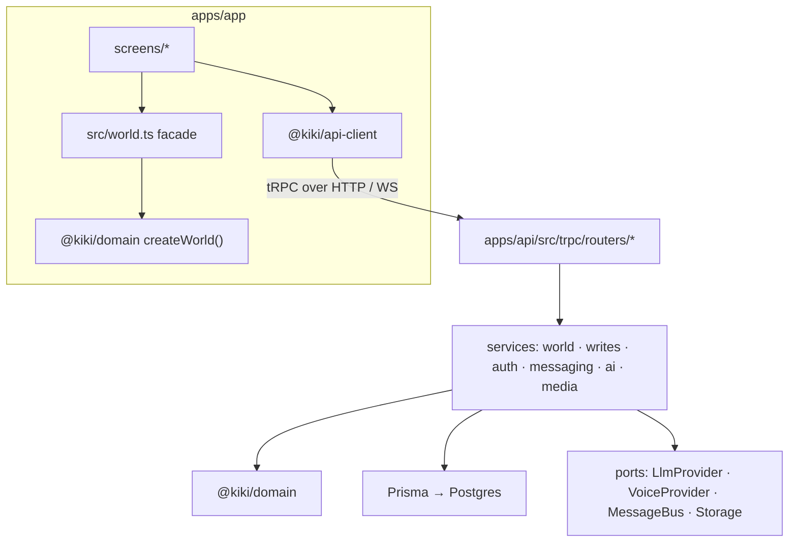
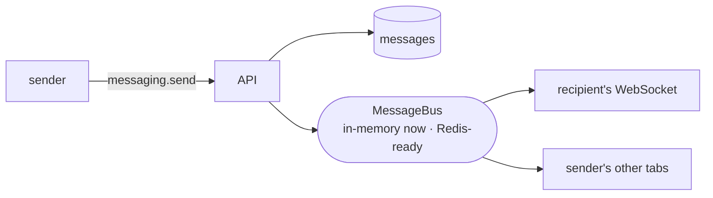
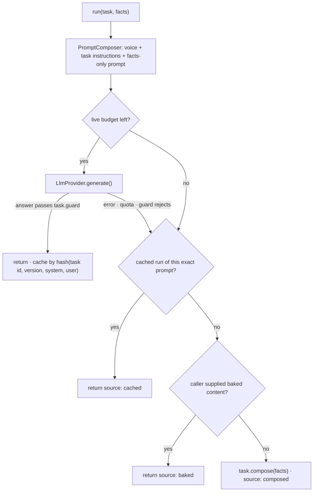

# Architecture

How Kiki is put together, and why it is put together that way. Read the [README](./README.md) first
for the premise; this document follows one request through every layer, then describes each layer on
its own. File paths are relative to the repo root and every one of them exists.

## Contents

1. [The shape](#1-the-shape)
2. [One request, end to end](#2-one-request-end-to-end)
3. [`@kiki/domain`: the trust brain](#3-kikidomain-the-trust-brain)
4. [`apps/api`: the system of record](#4-appsapi-the-system-of-record)
5. [`apps/app`: one source, two layouts, native and web](#5-appsapp-one-source-two-layouts-native-and-web)
6. [The AI layer](#6-the-ai-layer)
7. [The seed world](#7-the-seed-world)
8. [Ports and what they buy](#8-ports-and-what-they-buy)
9. [Data model](#9-data-model)
10. [Testing](#10-testing)
11. [Constraints and what they cost](#11-constraints-and-what-they-cost)

---

## 1. The shape

Three packages and two apps in a pnpm + Turborepo workspace.

```
packages/domain      pure logic, shared verbatim by server and apps
packages/api-client  typed tRPC client, compiled against the API's exported router type
packages/voice       the voice port (stub) and the pipeline that would fill it
apps/api             NestJS + Prisma + tRPC + WebSocket; Postgres on Neon; deployed on Render
apps/app             Expo / React Native; native iOS and react-native-web from one source
```

The rule that organises everything: **business logic lives in `@kiki/domain` and nowhere else.** The
API is a thin shell that loads rows and hands them to the domain; the app is a thin shell that renders
what the domain returns. If a trust story is wrong, there is exactly one place it can be wrong, and it
has a unit test.



---

## 2. One request, end to end

Take the most Kiki-specific screen: a guest opens a host's **Trust page**.

1. **The app already has the answer.** On sign-in, `WorldProvider`
   ([`apps/app/src/api/world-provider.tsx`](./apps/app/src/api/world-provider.tsx)) calls
   `world.snapshot` on the API and hands the result to `setWorldData()` in
   [`apps/app/src/world.ts`](./apps/app/src/world.ts), which builds a `World` with
   `createWorld()` from `@kiki/domain`. Until the snapshot lands, the same facade is backed by bundled
   fixtures, so the first paint is instant and the screens never block on the network.

2. **The screen asks the facade, synchronously.** `TrustScreen` calls
   `world.trustStoryFor(hostId)`. That runs [`packages/domain/src/world.ts`](./packages/domain/src/world.ts),
   which composes:
   - the shortest routes from the viewer to the host over the vouch graph
     ([`domain/graph.ts`](./packages/domain/src/domain/graph.ts));
   - each route's weight and the ranking between routes
     ([`domain/ties.ts`](./packages/domain/src/domain/ties.ts));
   - the overlaps between the two people, from typed facts and from what they and their guests wrote
     ([`domain/similarity.ts`](./packages/domain/src/domain/similarity.ts),
     [`pipeline/textSignals.ts`](./packages/domain/src/pipeline/textSignals.ts));
   - the host's and the guest's evidence, kept apart
     ([`domain/guestRecords.ts`](./packages/domain/src/domain/guestRecords.ts));
   - and a plain statement of what Kiki cannot say, when the evidence runs out.

3. **The server computed the same thing.** `world.snapshot`
   ([`apps/api/src/trpc/routers/world.router.ts`](./apps/api/src/trpc/routers/world.router.ts)) loads
   the viewer's slice of the graph through `WorldRepository` and returns typed `WorldData`. The API
   uses the same `createWorld()` for its own reads (the Explore feed sorted by degree, for example), so
   client and server never disagree about who is two steps from whom.

4. **The one thing the app cannot do alone is the introduction.** The Trust page calls
   `ai.intro`. [`intro.service.ts`](./apps/api/src/ai/intro.service.ts) reads the facts from the
   live graph with `world.trustStoryFor(hostId)` and hands that story and `INTRO_TASK` to the
   `AiRunner` ([section 6](#6-the-ai-layer)); the task owns the wording, through the
   `mutualFriendPrompt` the `PromptComposer` calls
   ([`introTask.ts`](./packages/domain/src/ai/introTask.ts)). The reply carries
   `source: 'live' | 'cached' | 'baked' | 'composed'`, and the screen shows it.

5. **The client is typed all the way.** [`apps/api/src/contract.ts`](./apps/api/src/contract.ts)
   exports the router type only; `@kiki/api-client` is compiled against it; the app's call sites are
   checked against it in `pnpm typecheck`. Rename a procedure and the app fails to build.

Writes go the other way through the same seam. A stay request is `requests.create` →
[`writes/requests.service.ts`](./apps/api/src/writes/requests.service.ts): Zod-validated input, an
idempotency key ([`common/idempotency.service.ts`](./apps/api/src/common/idempotency.service.ts)),
one Prisma transaction, host-guarded decisions (only the host can accept), then a notification and a
fresh snapshot.

---

## 3. `@kiki/domain`: the trust brain

`packages/domain/src`. Pure TypeScript: no IO, no framework, no dates from the wall clock unless
passed in. Everything here is unit-tested (75 tests) and runs identically in Node, on iOS and in a
browser.

| Module | What it owns |
|---|---|
| `domain/types.ts` | The vocabulary: `Member`, `Trait`, `Vouch`, `Listing`, `GuestReview`, `TrustStory`, `Overlap`, `RouteView`… |
| `domain/graph.ts` | The vouch graph: degree of separation, shortest routes, ring counts. |
| `domain/ties.ts` | Tie weight = 2·stays + 1·shared events + 1.5·[invite] + 1·[friend], decayed by 0.5^(months since last contact / 18). Routes rank by (weakest link, then sum). The number is never displayed; the sentence that produced it and a three-bar meter are. |
| `domain/similarity.ts` | Overlaps in two passes: exact typed facts first, then canonical topics extracted from bios and guest-book entries. Every overlap carries `source: 'profile' \| 'bio' \| 'guest_book'`. |
| `pipeline/textSignals.ts` | Lexicon-based, deterministic topic extraction. A signal is a claim about a topic ("climbing"), never about character. This is where an embedding model would sit later: text in, canonical signals out, nothing downstream changes. |
| `pipeline/nlp.ts`, `pipeline/tiering.ts` | Guest-book sentiment roll-up; contribution tiers as words. |
| `domain/mutualFriendIntro.ts` | Turns overlaps, mutuals and vouch notes into a facts-only brief. Vouch notes are fenced as data; the brief says who is being introduced. |
| `ai/task.ts`, `ai/introTask.ts`, `ai/drafts.ts` | The AI contract and the two task families ([section 6](#6-the-ai-layer)). |
| `domain/stay.ts`, `domain/requests.ts`, `domain/trips.ts`, `domain/invite.ts` | Stay lengths and the shorter-stay counter-offer, request state, trips and partial-cover offers, the invite tree ("who you brought in"). |
| `world.ts` | `createWorld(data)`: the composed read model every screen and the API share. |
| `seedWorld.ts` | The 5,000-member generator ([section 7](#7-the-seed-world)). |

Design rule inside the package: a function receives the world and returns a value; it never reaches
out for data. That is what makes the same code correct on a phone with a snapshot and on a server with
a database.

---

## 4. `apps/api`: the system of record

NestJS for dependency injection and module boundaries; tRPC for the contract; Prisma for Postgres;
Zod on every input.

```
src/
  main.ts                 Express + tRPC HTTP adapter, a WebSocket server on the same process,
                          /health, and a self-ping every nine minutes when RENDER_EXTERNAL_URL is set
  contract.ts             the router type export (type-only; pulls no server code into clients)
  trpc/                   context (actor from the access token), public and protected procedures,
                          and one router per area: auth, world, members, listings, trust, graph,
                          requests, trips, guestbook, messaging, media, ai, demo. Host guards
                          (only the host decides a request) live in the write services.
  auth/                   invite → OTP → access JWT (15 min) + refresh token (30 days), rotation
                          with reuse detection: a rotated token presented again revokes its family
  world/                  WorldRepository (rows → WorldData) and WorldService (domain reads)
  writes/                 requests, trips, guest book: user-scoped, host-guarded, transactional
  messaging/              persist a message, then publish on the MessageBus; WS subscribers fan out
  ai/                     AiRunner, PromptComposer, the intro and draft services, the LLM and voice
                          providers
  media/                  signed uploads through a storage port, image validation
  common/                 idempotency keys, rate limits, the actor type
  prisma/                 PrismaService
import/                   import.ts (typed adapter, sample.json), seed-world.ts, measure-imported-ties.ts
prisma/                   schema.prisma, migrations, seed.ts (the 14-member demo world)
```

**Auth in one diagram**

```mermaid
sequenceDiagram
  participant U as App
  participant A as API
  participant DB as Postgres
  U->>A: auth.requestOtp(email, inviteCode?)
  A->>DB: validate invite · find or prepare user
  A-->>U: OTP sent (emailed; shown on screen in demo mode)
  U->>A: auth.verifyOtp(email, code)
  A->>DB: claim invite · create user · issue refresh family
  A-->>U: access JWT (15 min) + refresh token (30 days)
  U->>A: auth.refresh(refreshToken)
  A->>DB: rotate; if the token was already rotated, revoke the whole family
  A-->>U: new pair
```

**Real-time in one diagram**



The message is persisted before it is published, so a dropped socket loses nothing; the socket is a
cache of the database, not the source of truth.

**Demo hygiene.** `DEMO_MODE=1` enables a one-tap demo login and `demo.reset`, which restores the
seeded world. A shared demo that someone has filled with test data is never stranded.

---

## 5. `apps/app`: one source, two layouts, native and web

Expo SDK 52, React Native 0.76, react-native-web. One `App.tsx`; one set of screens.

```
App.tsx                      providers (session, world), navigation, and the layout switch
src/api/                     client.ts (tRPC + WebSocket link, token storage, wakeApi()),
                             session.tsx (never blocks on the network; verifies in the background),
                             world-provider.tsx (snapshot → world facade)
src/world.ts                 the facade every screen imports: world.trustStoryFor(), world.allListings()…
src/screens/                 phone screens: Explore, HostProfile, Trust, Connection, Requests, Trips,
                             PlanTrip, TripOffers, Messages, Thread, GuestBook, Community, Me,
                             Notifications, Matched, Onboard, InviteGate, DemoEntry
src/screens/web/             the wide layout: WebShell and two-column versions of the same screens,
                             plus modals (graph, offer, write entry) that the phone renders as screens
src/ui/                      the design system in code: TrustPill, TierBadge, RouteGraph, RouteList,
                             ConnectionPath, LivingMap, SlideToAccept, MutualFriendIntro, OverlapList,
                             FactsEditor, glyphs/, motion, useReducedMotion, useResponsive, feedback
src/theme/tokens.ts          the palette, type scale and spacing, taken from Kiki's product
src/domain/                  app-local copies of the domain types (kept in step with @kiki/domain)
```

**The layout switch is one line.** `useResponsive()` reports `isWide` at 1080px; `App.tsx` renders
`WebShell` when wide and the phone navigator otherwise. The screens underneath are the same
components and call the same facade. There is no second codebase for the desktop.

**Why a facade.** Screens call `world.*` synchronously. The facade is backed by bundled fixtures
until the API snapshot arrives, then by the live snapshot, then by each refreshed snapshot after a
write. That is what makes the first paint instant on a free-tier API that may be asleep, and what
lets the same screens run in the showcase's on-screen iPhone with no backend at all.

**Native-only modules are loaded lazily.** `expo-haptics` has no web build and throws at import in
a browser, so [`ui/feedback.ts`](./apps/app/src/ui/feedback.ts) requires it only on native and maps
each semantic event (selection, intro landed, offer accepted) to the right Taptic pattern; the web
gets the Vibration API where a browser has it, and a silent no-op otherwise.

**Motion respects the person.** `useReducedMotion` gates every spring and the match moment;
`SlideToAccept` adds resistance as the thumb travels, so a yes takes intent; the held match screen
says "You do nothing" before anything else.

---

## 6. The AI layer

The whole layer is one contract and one runner.

**The contract** ([`packages/domain/src/ai/task.ts`](./packages/domain/src/ai/task.ts)):

```ts
interface AiTask<F> {
  id: string;            // stable; part of the cache key and every log line
  version: number;       // bump when the prompt changes; old cached runs stop matching
  instructions: string;  // what this task asks; tone is NOT here (that is the voice port)
  prompt(facts: F): string;                    // facts only; member text fenced as DATA
  guard(text: string, facts: F): GuardResult;  // is the answer usable?
  compose(facts: F): string;                   // the deterministic twin; always available
}
```

**The runner** ([`apps/api/src/ai/ai-runner.service.ts`](./apps/api/src/ai/ai-runner.service.ts))
is the only place a model is called. For any task it walks one ladder and reports which rung spoke:



Consequences of this shape:

- **Adding an AI feature is writing a task.** No feature carries its own fallback, cache, key
  handling or guard plumbing, and none can forget them.
- **Voice is orthogonal.** `VoiceProvider` ([`voice.provider.ts`](./apps/api/src/ai/voice.provider.ts),
  port in `@kiki/voice`) supplies the system-level tone. Kiki's corpus would shape that and nothing
  else; a task can change without touching tone, and tone without touching a task.
- **Honesty is enforced, not hoped for.** `dataBlock()` fences every member-written string between
  markers the instructions tell the model to treat as data. `baseGuard` rejects links, markup and
  leaked instructions; `namesGuard` rejects any person the facts never mentioned. A rejected answer
  is logged with the reason, and the twin is served.
- **Nothing is sent by the AI.** The intro is displayed; the three drafts land in the compose box
  for the person to edit and send.

**The two task families**

- [`introTask.ts`](./packages/domain/src/ai/introTask.ts): the mutual-friend introduction. Its
  guard requires the host's name, rejects the model introducing "you and <someone from a vouch
  note>", and rejects "we haven't met" phrasing. On its first live run it caught the model
  introducing the subject of a vouch note instead of the host; the prompt now states who is being
  introduced and the guard would catch a regression.
- [`drafts.ts`](./packages/domain/src/ai/drafts.ts): three drafts for a cold match, from the
  writer's own vantage point: introduce me properly, a quick call before you decide, a shorter
  first stay (the shorter length comes from `domain/stay.ts`). The app composes the deterministic
  twin instantly on the device, then upgrades to the live draft if the person has not started
  typing.

**Provider detail that mattered.** Gemini's reasoning tokens ate a small output cap and produced
truncated answers the guard rejected. The provider now sets a thinking budget, a 2048-token cap,
treats `MAX_TOKENS` as no answer, and times out at fifteen seconds; the ladder handles the rest.

---

## 7. The seed world

[`packages/domain/src/seedWorld.ts`](./packages/domain/src/seedWorld.ts) generates a club the size
Kiki is heading for, deterministically from a seed: an invite tree grown from a founder's first
hundred coffees, events, friendships, and completed matches each adding a stay and a guest-book
entry. No real people.

Why it exists: at 14 members "two steps from you" is the normal case; at 5,000 with a realistic
invite tree it is rare, and every screen that says "two steps" had to be designed against that.
The measured shape (`worldStats`, `reachFrom`):

- 5 vouch ties for the median member;
- about 1% of the club within two steps of a random member, 6–7% within three, nearly two-thirds
  five or more away;
- roughly a dozen of 819 hosts within two steps.

Three product consequences followed: three steps became the working unit for graph copy and
drawing; similarity from bios and guest books entered the product because the vouch graph alone
cannot introduce most pairs; and a "connect your contacts" step was shown to matter more than
ranking (see the imported-ties table in the README, reproduced by
[`apps/api/import/measure-imported-ties.ts`](./apps/api/import/measure-imported-ties.ts)).

The seed world goes through the same typed import adapter as real data
([`apps/api/import/import.ts`](./apps/api/import/import.ts)), so the path Kiki would use for its own
rows is already exercised. [`__tests__/seedWorld.test.ts`](./packages/domain/src/__tests__/seedWorld.test.ts)
pins the shape.

---

## 8. Ports and what they buy

| Port | Bound to today | Swap for | Touches |
|---|---|---|---|
| `LlmProvider` ([`ai/llm.provider.ts`](./apps/api/src/ai/llm.provider.ts)) | Gemini, server-side, key in env | any model | one provider file |
| `VoiceProvider` ([`@kiki/voice`](./packages/voice)) | a documented stub | the corpus-derived voice pack | one binding; no task changes |
| `MessageBus` ([`messaging/message-bus.ts`](./apps/api/src/messaging/message-bus.ts)) | in-process EventEmitter | Redis ([`redis-bus.ts`](./apps/api/src/messaging/redis-bus.ts)) for multi-instance | one binding |
| Storage ([`media/storage.ts`](./apps/api/src/media/storage.ts)) | blob storage | S3 | one adapter |
| `WorldData` | Prisma rows via `WorldRepository` | Kiki's own tables via the import adapter | the repository |

The point of the ports is not abstraction for its own sake: they are the exact seams where a solo
free-tier demo differs from Kiki's production (AWS, Redis, S3, its own data), so the swap is
mechanical.

---

## 9. Data model

[`apps/api/prisma/schema.prisma`](./apps/api/prisma/schema.prisma) mirrors the domain types one to
one, so the seed, the import adapter and the read model speak the same vocabulary.

| Area | Models |
|---|---|
| People and trust | `Member`, `Trait`, `Vouch` (with `kind`: invite, friend, stay…), `Contribution`, `GuestReview`, `Review` |
| Homes and stays | `Listing`, `StayRequest` (with the `commitments` a guest agreed to), `Trip`, `TripOffer`, `HouseItem` (a listing's rules, would-loves and care items; read on its own, never folded into the world snapshot) |
| Accounts | `User`, `Invite`, `OtpToken`, `RefreshToken` |
| Messaging | `Thread`, `Message` |
| Infrastructure | `IdempotencyKey`, `AiCache` (keyed by hash of task id, version, system and user prompt), `GeneratedContent` (baked copy) |

Migrations are applied by `prisma migrate deploy` in the Render build, so a deploy never runs
against a schema it does not expect.

---

## 10. Testing

| Where | What | How to run |
|---|---|---|
| `packages/domain/src/**/__tests__` | 75 unit tests: graph, ties, geo, similarity and NLP, tiering, the intro and draft tasks with their guards, the seed world's shape, the world read model | `pnpm --filter @kiki/domain test` |
| `apps/api/src/__tests__/integration.test.ts` | against a real Postgres: Explore sorted by degree, a warm trust story, the AI ladder offline (baked/composed), drafts scoped to the signed-in member, invite-gated signup, guest-requests-host-decides | `pnpm --filter @kiki/api test` (needs `DATABASE_URL`) |
| workspace | typecheck, including the app against the exported contract | `pnpm typecheck` |

CI runs the domain tests and the typecheck on every push, and the API suite when a database secret
is configured. Everything is `vitest`.

---

## 11. Constraints and what they cost

Built on a Windows PC and tested natively on an iPhone through Expo Go, with free tiers for every
service. The consequences, and what they would cost Kiki to undo:

| Constraint | Consequence in this repo | To undo |
|---|---|---|
| No Xcode, no dev-client | every dependency is Expo Go-safe; no custom native modules; the map is SVG + gradient + Reanimated, not Skia | nothing: it also gives one implementation for native and web |
| Free-tier API that sleeps | wake bar in the app, self-ping on the server, a session that never blocks on the network | remove the ping; keep the non-blocking session, it is good anyway |
| No AWS or Terraform | Render blueprint, Neon Postgres, blob storage port | rebind the ports; the app does not change |
| Git Bash on Windows | `MSYS_NO_PATHCONV=1` around the showcase repo's export step, because Git Bash rewrote its `/try/app` base path into a Windows path; this repo's `export:web` needs no flag | nothing |
| Solo, in evenings | the showcase and the design record exist so a reviewer needs neither a phone nor a walkthrough | nothing |
