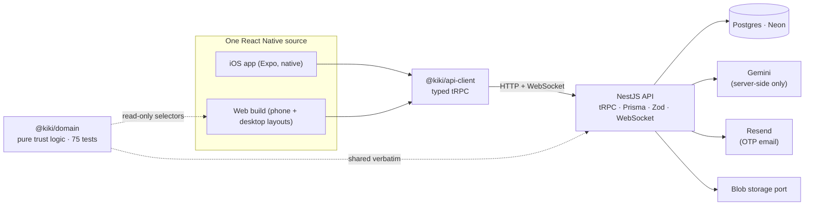

# Kiki

[](https://github.com/hrbohra/kiki/actions/workflows/ci.yml)

A working build of Kiki, the invite-only sublet club, on its own stack: **React Native · TypeScript ·
NestJS · Postgres**. One React Native source for the native iOS app and the web, a real backend, and an
AI mutual friend that may only say what the trust graph proves. Built end to end by Harsh Bohra from a
hiring manifesto, a job description and a podcast, without ever opening Kiki's app.

| | |
|---|---|
| **Try it** | https://kiki-portfolio-one.vercel.app — one tap into a seeded world; no account, no email |
| **Design record** | https://kiki-portfolio-one.vercel.app/design — why every screen is the way it is, with proof |
| **Architecture** | [ARCHITECTURE.md](./ARCHITECTURE.md) — how a request moves through the system, package by package |
| **Decisions** | [DECISIONS.md](./DECISIONS.md) — each decision, the obvious build it replaces, and why |
| **Threat model** | [THREAT_MODEL.md](./THREAT_MODEL.md) — assets, trust boundaries, mitigations, known gaps |
| **Deploying** | [DEPLOY.md](./DEPLOY.md) — Neon, Render, Vercel, all on free tiers, kept warm |
| **Voice** | [packages/voice/VOICE_PIPELINE.md](./packages/voice/VOICE_PIPELINE.md) — where Kiki's corpus would plug in, and the one hard rule |

---

## How it was built: premise, measurement, decisions, proof

Kiki's premise is that the person comes first and the room is a consequence: the only currency is who
will put their name next to yours. Everything in this repo follows from that in one direction.

**1. Premise → the shape of the product.** Homes are ranked by degrees of separation, never price.
The trust page is the product, not a rating. A vouch is shown as a debt. There are no timers on
requests. Each of these replaces an obvious build (price sort, star ratings, a 24-hour countdown)
that would have been easier and would have broken the premise. [DECISIONS.md](./DECISIONS.md)
names the obvious build for every one.

**2. Where I did not know, I measured.** In a 14-member demo world "two steps from you" is the
normal case. I generated a 5,000-member club from Kiki's own invite mechanics
([`packages/domain/src/seedWorld.ts`](./packages/domain/src/seedWorld.ts)) and found the truth:
the median member holds 5 vouch ties, yet only about 1% of the club sits within two steps, 6–7%
within three, and nearly two-thirds are five or more steps away. That shape reshaped the graph
screens, put similarity from bios and guest books into the product, and says a contacts-import
step is worth more than any ranking work.

| Ties added per member | Median ties per member | Club at 2 steps | Club at 3 steps | Hosts within 2 steps |
|---|---|---|---|---|
| 0 | 5 | 1.0% | 7.0% | 12 |
| 4 | 9 | 2.2% | 20.3% | 25 |
| 10 | 16 | 5.2% | 52.4% | 52 |
| 20 | 26 | 12.9% | 82.7% | 120 |

Reproduce it: `pnpm --filter @kiki/api seed:world`, then `pnpm --filter @kiki/api measure:ties`.
A unit test pins the shape, so a change to the generator that quietly makes the club friendlier
fails CI.

**3. The AI follows one contract, because a mutual friend who invents things is worse than none.**
Every AI feature is an [`AiTask`](./packages/domain/src/ai/task.ts): the facts it may use, a
facts-only prompt with member-written text fenced as data, a guard on the answer, and a
deterministic twin. One runner executes every task through the same ladder, live → cached → baked
→ composed, and always reports which one spoke. The guard caught the model introducing the wrong
person on its first day.

**4. Every decision carries its proof**: a screen you can open in the demo, a diagram, a test, or
the file itself. The design record links to all of them.

---

## What is here

```
packages/
  domain/       @kiki/domain — pure business logic, no IO, no UI. The trust graph, tie weighting and
                route ranking, similarity (typed facts + topics from bios and guest books), the
                mutual-friend intro, the three drafted messages, the composed "world" read model,
                and the 5,000-member seed-world generator. 75 unit tests.
  api-client/   @kiki/api-client — the typed tRPC client, compiled against the API's exported
                contract, so a changed endpoint fails the build rather than the user.
  voice/        @kiki/voice — the port through which Kiki's corpus would give the AI its voice.
                Ships as a documented stub; the corpus is not here.
apps/
  api/          NestJS — Postgres via Prisma, tRPC over HTTP + WebSocket, invite → OTP → rotating
                JWT auth with reuse detection, persisted requests / trips / guest book, real-time
                messaging through a pub/sub port, media through a storage port, the AI runner,
                idempotency keys, rate limits, a demo reset. Deployed on Render. Integration tests
                against a real Postgres.
  app/          One React Native (Expo) source for the native iOS app and the web: phone layouts
                and a wide desktop layout from the same screens and the same domain selectors.
                Exported with react-native-web for the demo.
```

The showcase site (the phone emulator, the desktop embed, the design record) lives in
[`hrbohra/kiki-showcase`](https://github.com/hrbohra/kiki-showcase) and embeds the web export of
`apps/app`.

### Files worth opening first

| If you want to see… | Open |
|---|---|
| The AI contract, in one file | [`packages/domain/src/ai/task.ts`](./packages/domain/src/ai/task.ts) |
| The only place a model is ever called | [`apps/api/src/ai/ai-runner.service.ts`](./apps/api/src/ai/ai-runner.service.ts) |
| The intro task: facts, prompt, guard, twin | [`packages/domain/src/ai/introTask.ts`](./packages/domain/src/ai/introTask.ts) |
| The three drafted messages for cold matches | [`packages/domain/src/ai/drafts.ts`](./packages/domain/src/ai/drafts.ts) |
| Tie strength and route ranking, with the formula | [`packages/domain/src/domain/ties.ts`](./packages/domain/src/domain/ties.ts) |
| Similarity over facts, bios and guest books | [`packages/domain/src/domain/similarity.ts`](./packages/domain/src/domain/similarity.ts), [`pipeline/textSignals.ts`](./packages/domain/src/pipeline/textSignals.ts) |
| The 5,000-member world and why it exists | [`packages/domain/src/seedWorld.ts`](./packages/domain/src/seedWorld.ts) |
| The read model every screen uses | [`packages/domain/src/world.ts`](./packages/domain/src/world.ts), [`apps/app/src/world.ts`](./apps/app/src/world.ts) |
| Auth: OTP, rotating refresh tokens, reuse detection | [`apps/api/src/auth/auth.service.ts`](./apps/api/src/auth/auth.service.ts), [`tokens.ts`](./apps/api/src/auth/tokens.ts) |
| Real-time as a port (in-memory now, Redis later) | [`apps/api/src/messaging/message-bus.ts`](./apps/api/src/messaging/message-bus.ts) |
| Haptics that mean something, safe on web | [`apps/app/src/ui/feedback.ts`](./apps/app/src/ui/feedback.ts) |
| Slide-to-match and the held match moment | [`apps/app/src/ui/SlideToAccept.tsx`](./apps/app/src/ui/SlideToAccept.tsx), [`screens/MatchedScreen.tsx`](./apps/app/src/screens/MatchedScreen.tsx) |
| The data model | [`apps/api/prisma/schema.prisma`](./apps/api/prisma/schema.prisma) |
| The integration tests, as a tour of the API | [`apps/api/src/__tests__/integration.test.ts`](./apps/api/src/__tests__/integration.test.ts) |

---

## The system in one picture



Three properties fall out of this shape:

- **The domain is shared verbatim.** The server and both apps import the same `@kiki/domain`, so the
  demo world and the real backend compute identical trust stories, routes and overlaps.
- **The API contract is a build artefact.** `apps/api` exports its router type; `@kiki/api-client` is
  compiled against it; a renamed procedure is a type error in the app, not a runtime surprise.
- **Every external dependency sits behind a port**: the model (`LlmProvider`), the voice
  (`VoiceProvider`), pub/sub (`MessageBus`), storage. Swapping in-memory for Redis, or Gemini for
  another model, touches one binding.

[ARCHITECTURE.md](./ARCHITECTURE.md) walks a request through every layer.

---

## What shipped

**Trust as the product**
- Explore ranks homes by degrees of separation; the price is a detail on the card.
- Every shortest route to a host is drawn and ranked by measured tie strength
  (2·stays + 1·events + 1.5·invite + 1·friend, decayed with an 18-month half-life). The number is
  never shown; the sentence that produced it is.
- The trust page has a host side and a guest side, and says plainly what Kiki cannot tell you.
- "Ask Nina": on a route of two or more steps, the button asks the mutual first, because that
  message is how a graph learns.
- The invite tree is visible as "who you brought in"; tiers read as words, nobody is ranked.

**The AI mutual friend, honest by construction**
- The introduction, the similarity read over profile facts, bios and guest-book entries, and three
  drafted messages for cold matches (introduce me properly, a quick call first, a shorter first
  stay) all run as `AiTask`s through one runner.
- Member-written text is fenced as data in every prompt; the guard rejects links, markup, leaked
  instructions and any name the facts never mentioned; a rejected answer is logged and the
  deterministic twin is served.
- The model proposes; a person edits and sends. Nothing is ever sent by the AI.
- Every overlap is labelled with where it came from: a profile fact, a bio, or the guest book.

**A real backend**
- Invite-only passwordless sign-in: invite → OTP → short-lived access JWT plus rotating refresh
  token; reuse of a rotated token revokes the whole family.
- Persisted stay requests, trips and offers (including partial cover), guest-book entries.
- Real-time messaging: persist, then fan out over WebSocket through the pub/sub port.
- Idempotency keys on writes, per-caller rate limits, a written threat model.
- A seeded world with a one-tap demo login and a demo-only reset, so a shared demo is never stranded.
- Cold-start handling for free-tier hosting: the app never blocks on the network, a wake bar
  appears if the API is asleep, and the API pings itself so it rarely is.

**Craft, from one source for iOS and web**
- Semantic haptics (selection, intro landed, offer accepted), slide-to-match with rising
  resistance, a held match moment, notifications, Reduce Motion and VoiceOver on every screen,
  layouts verified from 320px up, Kiki's own vocabulary throughout.
- A design system taken from Kiki's product: one palette, one type scale, twenty-two glyphs, with a
  contrast fix proposed where the original fell short (teal text at 9.6:1 where the original was 3.66:1).

---

## Constraints that shaped the stack

This was built on a Windows PC, the only machine available, and tested natively on an iPhone through
Expo Go. No Xcode, no dev-client builds, no TestFlight. That is a constraint rather than an opinion,
and it explains several choices:

- **Every dependency is Expo Go-safe.** No custom native modules. The animated map is
  react-native-svg, a gradient and Reanimated rather than Skia, which gives one implementation for
  native and web instead of two.
- **There is a web export**, so a reviewer needs no phone; the showcase embeds it in an on-screen
  iPhone and as a desktop layout.
- **Free tiers everywhere** (Neon, Render, Vercel, Gemini), so the API has to survive cold starts
  gracefully: hence the wake bar and the self-ping.
- **No AWS or Terraform.** Kiki's production runs there; a solo free demo does not need to. The
  ports above are where that swap would happen.

In Kiki's codebase these would be Kiki's conventions, not mine.

---

## Getting started

```bash
pnpm install
cp .env.example .env               # DATABASE_URL etc.; the model key never enters the client
pnpm build                         # domain + voice + api (refreshes the typed contract)
pnpm typecheck
pnpm --filter @kiki/domain test    # 75 tests, no database needed
pnpm --filter @kiki/api migrate    # apply migrations to your database (before the API tests)
pnpm --filter @kiki/api test       # integration tests against a real Postgres (DATABASE_URL)
pnpm --filter @kiki/api seed       # the 14-member demo world (resets demo data)
pnpm --filter @kiki/api dev        # API with watch
pnpm --filter @kiki/app start      # native via Expo Go, or `expo start --web`
```

Env lives in one root `.env` (never committed; `.env.example` is the template). The Gemini key is
read by the API only and never reaches a client bundle.

**Scale-shaped data**

```bash
pnpm --filter @kiki/api seed:world      # generate the 5,000-member world (deterministic seed)
pnpm --filter @kiki/api measure:ties    # reproduce the imported-ties table above
pnpm --filter @kiki/api import:data import/sample.json   # real rows through the same typed adapter
```

The import path is the same for the seed world and for real data: Kiki could point this at its own
members and listings without touching app code.

---

## Tests and CI

| Suite | What it pins | Runs |
|---|---|---|
| `@kiki/domain`, 75 unit tests | graph and routes, tie weights and decay, similarity and text signals, the intro and draft tasks with their guards, the seed world's shape, the world read model | every push, no database |
| `@kiki/api`, integration against real Postgres | Explore sorted by degree, warm trust stories, the AI ladder offline, drafts scoped to the signed-in member, invite-gated signup, host-guarded writes | every push when a database secret is configured; always locally |
| Typecheck across the workspace | the app against the API's exported contract | every push |

CI is [`.github/workflows/ci.yml`](./.github/workflows/ci.yml). A second workflow pings the API to
keep the free tier warm.

---

## About the corpus

Kiki's real ~10k-conversation corpus is **not here**, and nothing in this repo has touched it.
`@kiki/voice` is the port it would plug into, to shape the AI's voice and style only, never as
training data or as content about anyone. See
[`packages/voice/VOICE_PIPELINE.md`](./packages/voice/VOICE_PIPELINE.md) for the pipeline and its
one hard rule.

## Credit

Built by Harsh Bohra as an application to Kiki. Listing photos are credited in
[`apps/app/assets/listings/ATTRIBUTIONS.md`](./apps/app/assets/listings/ATTRIBUTIONS.md). Kiki's
name, product and vocabulary belong to Kiki.
